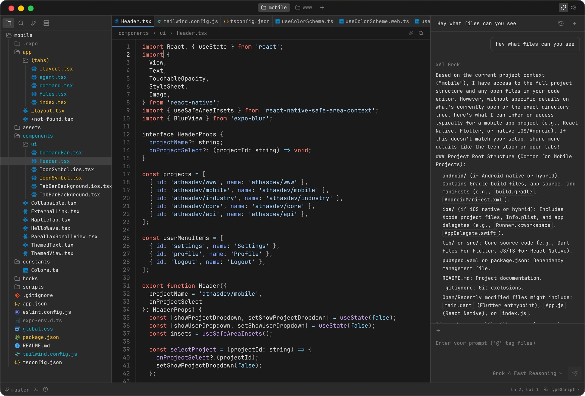

<div align="center">
  
  <h1>Blimy</h1>
  <p>A lightweight, cross-platform code editor, built with <a href="https://tauri.app/" title="Tauri">Tauri</a> (Rust and React) with Git support, AI agents, vim keybindings.</p>
  
</div>

## Features

- AI agents
- Git integration
- Syntax highlighting
- LSP support
- Vim keybindings
- Integrated terminal
- Database viewers
- Collaboration
- Enterprise policy controls (managed mode + extension allowlist)

## Installation

Prebuilt packages for macOS, Windows, and Linux are published on the
[GitHub Releases page](https://github.com/antan2002/blimy/releases). Linux releases include native
`.deb` and `.rpm` packages as well as a portable `.tar.gz` bundle.

Download the asset for your platform, then check it against the SHA256 checksum published on the
same release before you run it.

There are no install scripts, Homebrew casks, WinGet manifests, or Scoop buckets published yet.

## Development

To build Blimy from source, install [Node.js 24](https://nodejs.org),
[Bun 1.3.14](https://bun.sh), and [Rust](https://rustup.rs), then run:

```bash
git clone https://github.com/antan2002/blimy.git
cd blimy
bun setup
bun dev
```

`bun setup` installs the project dependencies and checks the native requirements for your
platform. See the [contributing guide](CONTRIBUTING.md) for validation commands and contribution
guidelines.

## Documentation

Documentation lives in this repository: see [CONTRIBUTING.md](CONTRIBUTING.md) for development setup and the doc comments in `src/` for feature detail.

## Contributing

Contributions are welcome! See the [contributing guide](CONTRIBUTING.md) and [Contributor License and Feedback Agreement](CONTRIBUTOR_LICENSE_AND_FEEDBACK_AGREEMENT.md).

## Support

- [Issues](https://github.com/antan2002/blimy/issues)
- [Discussions](https://github.com/antan2002/blimy/discussions)

## License

[AGPL-3.0](LICENSE)
